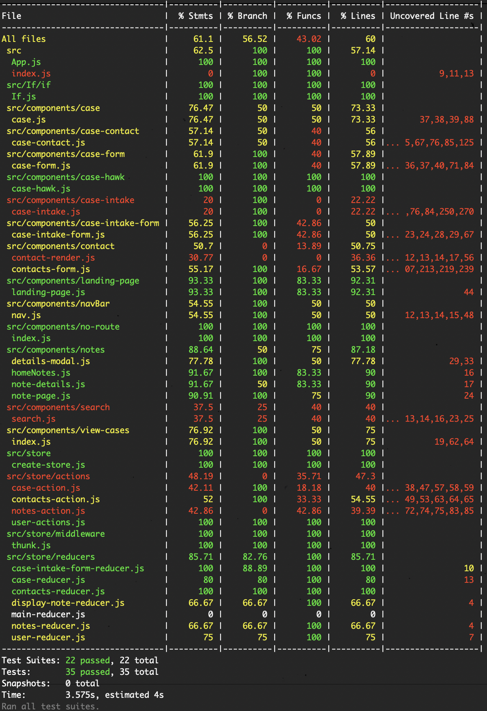
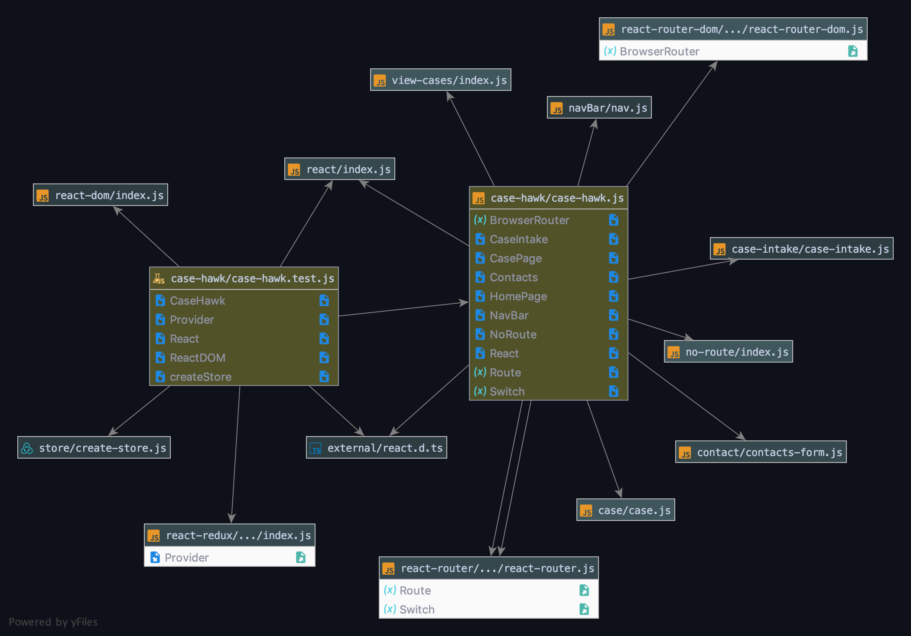

# JS 401 Final Project :: CaseHawk :: Front-End

## Overview
A small to medium-sized law firm can easily have hundreds of clients and thousands of contacts on a day-to-day basis. Having a web application that manages case and client information greatly increases efficiency and improves case management. Our app aims to securely store information and allow access to verified users. 

#### Features
- Displays case and contact information that is stored in the database.
- Case intake page allows the collection of information from new client quickly and save them to the database for future usage.
- Allows update of information for cases and contacts.

#### Tech / Framework Used
- Framework: React
- Libraries
    - react-cookies
    - react-dom
    - react-modal
    - react-redux
    - react-router-dom 
    - react-scripts
    - react-table
- Documentation: styleguidist

#### Design Choices
- Functional components used
- Redux

#### Current Version
1.1.1
​
## Pages
### Endpoint: `/`
#### Overview
- Initial landing page that allows the user to login using their Google account
- Home page displays upon successful log in. 
- Displays a list of cases and a list of notes, as well as the navigation bar with commonly used links.
- Currently all cases and all notes in the database are being displayed on this page.

#### Components
- `App.js`
- `landing-page.js`
- `case-hawk.js` A component that renders the home page with a Nav bar that hold our routes to other components
- `view-cases.js` A component that shows a list of cases, as well as a list of notes.
- `homeNotes.js` A component that that renders notes for cases that our available in our database.
- `details-modal.js` A modal component for each specific note that loads on click to view further details
- `note-page.js` A component that displays notes related to the case on the case page.
- `note-details.js` A component that renders an individual notes detail inside the modal.

#### Next Steps
- Only displays cases that are related to the logged-in user.
- Only displays notes recently accessed by the logged-in, sorted by most recent.
- The user having the ability to edit notes when viewing inside the modal, with timestamps.

### `/casePage/:id`
#### Overview
- When the user clicks on a specific case, they are taken to this page, which renders all the information and contacts related to that particular case. 
- This page should be editable and savable. 

#### Components
- `case.js` A higher order component that display all other components on the case page
- `contact-render.js` A component that displays the details of the client​
- `case-form.js` A component that displays case details and allows users to update the status, referral and legal plan of the case and save them to the database 
- `case-contact.js` A reusable component that displays all the contacts information related to the case, allows users to click on it to display details of the contact

#### Next Steps
- Search bar that allows users to search for the contacts saved in the database and add it to each related contact fields
- Add functionality to allow users to add new contacts to the related contact fields
- Delete functionality to allow users to remove some contacts from the related contact fields
- Displays notes that are related to the case and sorted by dates order
- Better UI design for the page
- Conflict alert for contact update

### `/contacts`
#### Overview
- This component lets the user create and save a new contact in the database.
- First Name and Last Name of the new contact are required. Other fields are optional.​

#### Components
- `contacts-form.js` Component that displays the form, and sends the input data to create a contact in the database
 
#### Next Steps
- Change route name to reflect button on nav bar​
- Add a error handler that throws an error if first Name or Last name hasn't been entered.
- Add type checking functionality that checks the type of input to the corresponding required type in the database and ask user to input correct type of data( Example, First name should not include data of type 'Number', SSN input should be of type 'Number'.)

### `/caseIntake`
#### Overview
- This component is designed to assist the user create a "Potential Case" when talking to a client over the phone. It creates a contact, Note, and New Case information simultaneously in the Database.

#### Components
- `case-intake.js` Component displays the forms for contact information, case information, and intake notes. Sends Input Data to database to create a new Case, Contact, and Note. 
- `contacts-form.js` Component that displays the form, and sends the input data to create a contact in the database.
- `case-intake-form.js` Component has three drop-down options for the user to set case details before form submission.

#### Next Steps
- Add a error handler that throws an error if first Name or Last name hasn't been entered.
- Add type checking functionality that checks the type of input to the corresponding required type in the database and ask user to input correct type of data(E.g. first name should not include data of type 'Number', SSN input should be of type 'Number'.)
- Conflict Checking functionality.
- Give user options to Choose the type of contact. (E.g. Referral, Opposing)
- Reroute to another page after submission. 
   
## Using CaseHawk
### Setup
#### Initial setup
* Clone repo
* `npm install`
* Please see `package.json` to confirm dependency details

#### `.env` requirements
* `REACT_APP_API` - URL to CaseHawk back-end

#### Running the app
* `npm start`
* Endpoint: `/`
  * Home route displays all the cases and notes
* Endpoint: `/casePage/:id`
  * Case detail route displays case details
* Endpoint: `/contacts`
  * Case contacts route allows users to add new contact information
* Endpoint: `/contacts`
  * Case contacts route allows users to add new contact information
* Endpoint: `/caseIntake`
  * Case intake route allows users to add new case information

## Tests
- Each test is stored with file that is being tested
- `npm run lint`
- `npm run test` - Framework: Jest

## UML

## Contributors
 401d31
- [**Austin Hedeen**](https://github.com/Bejoty)
- [**Benjamin Clark**](https://github.com/1benisin)
- [**Bradley G. Elliott**](https://github.com/BGElliott206)
- [**Corey Chang**](https://github.com/coreychang808)
- [**Evan BC**](https://github.com/EvanBC1)
- [**Hanna Alemu**](https://github.com/hannaalemu)
- [**Jessica Walters**](https://github.com/jessicakwalters)
- [**Joanna Arroyo**](https://github.com/joannaarroyo)
- [**Leyla Li**](https://github.com/Leyi-Li)
- [**Lillian Gales**](https://github.com/lillielise)
- [**Trae Bennett**](https://github.com/TraeBenn22)
